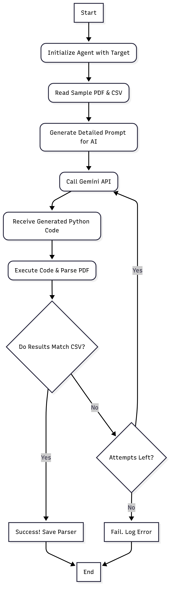

# 🤖 AI-Powered PDF Parsing Agent

This project features an **autonomous AI agent** built with Python and powered by the **Google Gemini API**.  
The agent's mission is to **automatically generate, test, and validate Python code** capable of parsing bank statement PDFs — without manual intervention.

It’s resilient, iterative, and smart — continuously improving its generated parser until it nails the correct output. 🧠⚡

---

### 🚀 Key Features

- 📝 **Autonomous Code Generation** — Writes Python code on the fly to parse complex PDFs.  
- ✅ **Self-Validating** — Dynamically executes and tests its own generated code in a secure, in-memory environment.  
- 🔁 **Iterative & Resilient** — Automatically retries on failure, refining the code with each attempt.  
- 🤝 **Powered by Gemini Pro** — Uses Google’s **gemini-2.5-pro** model for top-notch code generation.  
- 🌐 **Dynamic & Scalable** — Easily adapts to new bank PDF formats by just adding sample files.  
- 🧪 **Automated Testing Suite** — Uses `pytest` to validate all generated parsers continuously.

---
## 🏛️ Agent Architecture & Workflow

The agent operates on a robust, multi-layered strategy that combines the power of the Google Gemini LLM with a rigorous, automated validation system. The core of the agent is a self-correction loop that allows it to handle incorrect code generation and iteratively work towards a perfect solution.

The agent's workflow automates the creation of a functional Python parser through this intelligent loop. Initially, the agent crafts a highly detailed prompt by analyzing a sample PDF and its corresponding ground-truth CSV file, providing rich, contextual examples for the LLM. This kicks off an iterative cycle, capped at three attempts, where the agent receives Python code, executes it in a secure in-memory environment, and rigorously validates the output against the CSV data.

If validation is successful, the correct parser is saved, and the process ends. However, upon failure, the agent discards the faulty code and repeats the cycle, leveraging the LLM's capabilities to generate a new potential solution. This continues until a correct parser is created or all attempts are exhausted.

The following flowchart illustrates this decision-making process:

## 📊 Workflow Diagram

<p align="center">
  
</p>

### 🧠 How It Works

The agent follows a **multi-stage autonomous pipeline** to ensure the final parser is fully correct:

1. **Initialization**  
   The agent starts with a specific target (e.g., `icici`) and locates the sample PDF and CSV in the `data/` directory.

2. **Intelligent Prompt Engineering**  
   It reads the sample CSV to understand the exact structure and dynamically builds a detailed prompt for Gemini.

3. **AI Code Generation**  
   Sends the prompt to the Gemini API, which returns a **complete Python script** using `camelot-py` for PDF parsing.

4. **In-Memory Execution & Testing**  
   Runs the generated code in an isolated environment to parse the PDF.

5. **Validation**  
   Compares the parsed `pandas DataFrame` against the ground-truth CSV.

6. **Decision Loop**
   - ✅ **On Success:** Saves the working parser in `custom_parsers/` and exits.  
   - ❌ **On Failure:** Discards the code and retries, up to the max attempts.

---

## 📂 Folder Structure

```bash
AI-AGENT-CHALLENGE/
├── custom_parsers/         # ✅ Final successful parsers generated by the agent
│   └── icici_parser.py
├── data/                   # 📄 Sample data for each target bank
│   └── icici/
│       ├── icici_sample.csv    # Ground-truth data
│       └── icici_sample.pdf    # Sample bank statement PDF
├── output/                 # 🧾 Output CSV generated by the parser
│   └── icici_output.csv
├── .env                    # 🌐 Stores GOOGLE_API_KEY
├── agent.py                # 🧠 Main AI agent script
├── test_parsers.py         # 🧪 Pytest suite for validation
└── requirements.txt        # 📦 Python dependencies
```
---

### ⚙️ Setup & Installation
1. Clone the Repository

```bash
git clone <your-repo-url>
cd AI-AGENT-CHALLENGE
```
### 2. Create & Activate a Virtual Environment

```bash
# Create
python -m venv venv

# Activate on Windows
.\venv\Scripts\activate

# Activate on macOS/Linux
source venv/bin/activate
```

### 3. Install Dependencies

```bash
pip install -r requirements.txt
```

### 4. Set Up API Key

Create a .env file in the root directory and add your Google Gemini API key:

```bash
GOOGLE_API_KEY="YOUR_API_KEY_HERE"
```

## 🧠 Usage
▶️ Running the AI Agent

To generate a parser for a specific target (e.g., ICICI):

```bash
python agent.py --target icici
```

The agent will begin generating and validating the parser.
On success, the parser is stored in custom_parsers/.

### 🧪 Running the Tests

To validate all generated parsers:

```bash
pytest
```

The pytest suite automatically tests each parser defined in the TARGETS list inside test_parsers.py.

## 🏆 Summary

This project is a fully autonomous code-generation agent for parsing PDFs — no manual regex nightmares, no brittle scripts.
Just AI, iteration, and reliable outputs. ✨